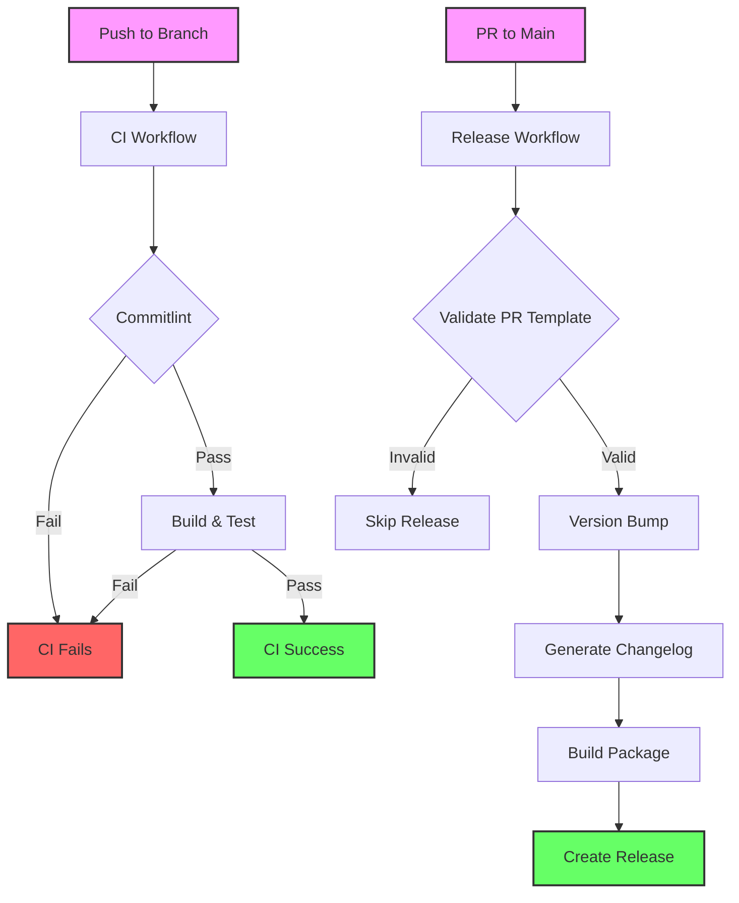
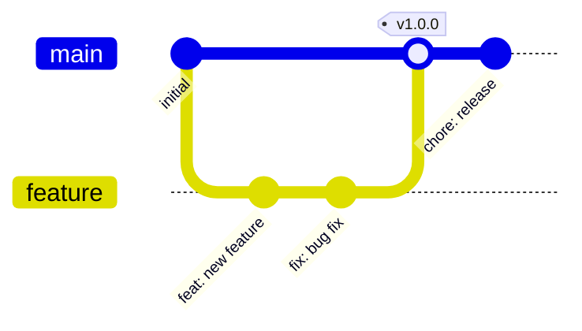
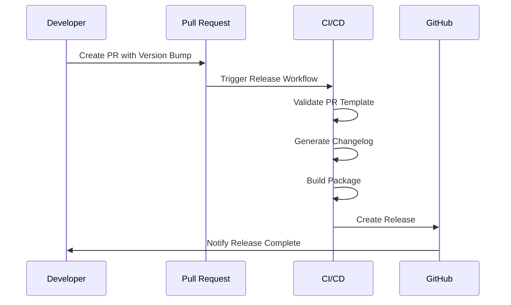
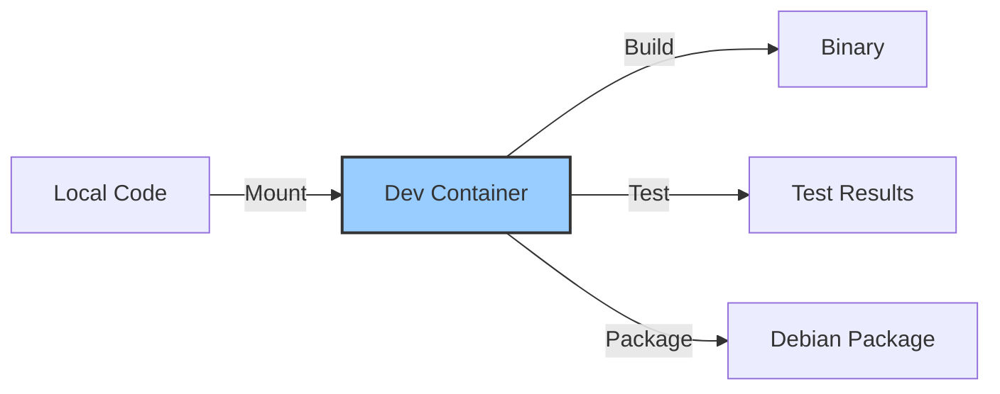

# Timbre Development Workflow

## CI/CD Pipeline

```mermaid
graph TD
    A[Push to Branch] --> B[CI Workflow]
    B --> C{Commitlint}
    C -->|Pass| D[Build & Test]
    C -->|Fail| E[CI Fails]
    D -->|Pass| F[CI Success]
    D -->|Fail| E

    G[PR to Main] --> H[Release Workflow]
    H --> I{Validate PR Template}
    I -->|Valid| J[Version Bump]
    I -->|Invalid| K[Skip Release]
    J --> L[Generate Changelog]
    L --> M[Build Package]
    M --> N[Create Release]
    
    style A fill:#f9f,stroke:#333,stroke-width:2px
    style G fill:#f9f,stroke:#333,stroke-width:2px
    style E fill:#f66,stroke:#333,stroke-width:2px
    style F fill:#6f6,stroke:#333,stroke-width:2px
    style N fill:#6f6,stroke:#333,stroke-width:2px
```

## Version Control Flow

```mermaid
gitGraph
    commit id: "initial"
    branch feature
    checkout feature
    commit id: "feat: new feature"
    commit id: "fix: bug fix"
    checkout main
    merge feature tag: "v1.0.0"
    commit id: "chore: release"
```

## Release Process

```mermaid
sequenceDiagram
    participant D as Developer
    participant PR as Pull Request
    participant CI as CI/CD
    participant GH as GitHub

    D->>PR: Create PR with Version Bump
    PR->>CI: Trigger Release Workflow
    CI->>CI: Validate PR Template
    CI->>CI: Generate Changelog
    CI->>CI: Build Package
    CI->>GH: Create Release
    GH->>D: Notify Release Complete
```

## Development Container

```mermaid
graph LR
    A[Local Code] -->|Mount| B[Dev Container]
    B -->|Build| C[Binary]
    B -->|Test| D[Test Results]
    B -->|Package| E[Debian Package]
    
    style B fill:#9cf,stroke:#333,stroke-width:2px
``` 