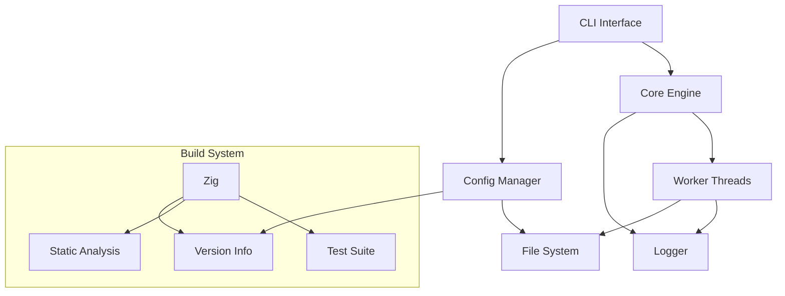
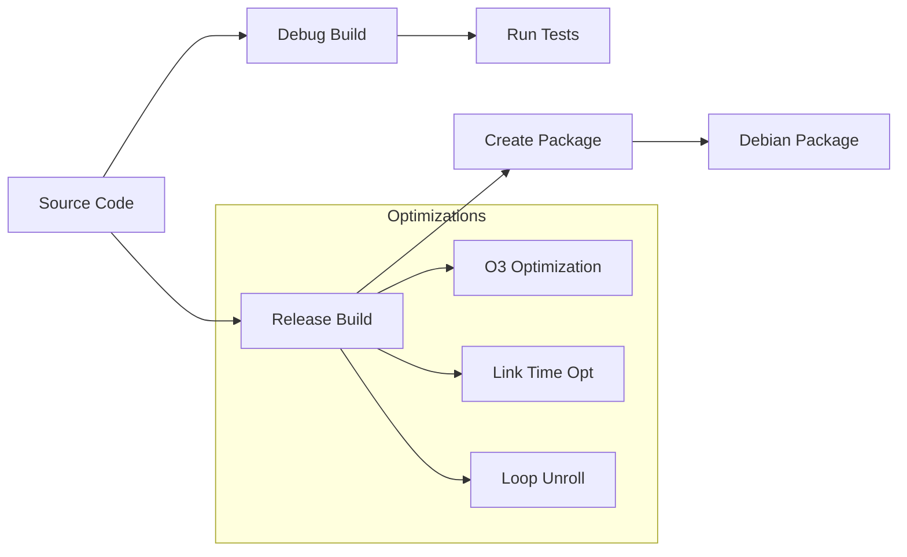
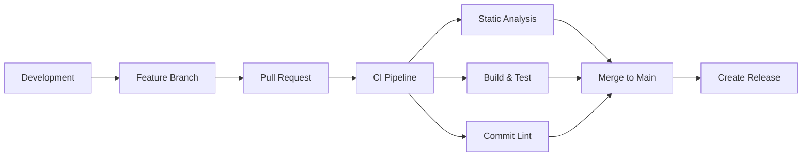

# Timbre Architecture

## Overview
Timbre is a modern C++ application designed for high performance and reliability. It uses a modular architecture with clear separation of concerns, built with Zig's build system.

## Component Architecture



## Key Components

### Build System
- Zig-based build system
- Multi-architecture support (x86_64, arm64)
- Integrated static analysis (clang-tidy, cppcheck)
- Automated testing with Zig test runner
- Version management system

### Core Components
- **CLI Interface**: Command-line interface using CLI11
- **Config Manager**: TOML-based configuration system
- **Core Engine**: Main application logic
- **Logger**: Asynchronous logging system
- **Version System**: Semantic versioning with dev/release management

## Build Configurations



## Development Workflow



## File Organization
```
timbre/
├── inc/               # Public headers
│   ├── timbre/       # Core headers
│   ├── toml/         # TOML parser
│   └── CLI/          # CLI11 library
├── src/              # Implementation files
│   ├── main.cpp      # Entry point
│   ├── timbre.cpp    # Core functionality
│   ├── config.cpp    # Configuration handling
│   └── log.cpp       # Logging system
├── tests/            # Test suite
│   ├── test.zig      # Zig test runner
│   ├── interface.c   # C interface tests
│   └── interface.h   # Test headers
├── docs/             # Documentation
└── pkg/              # Packaging
    ├── build_deb.sh  # Debian package builder
    └── version.txt   # Version file
``` 