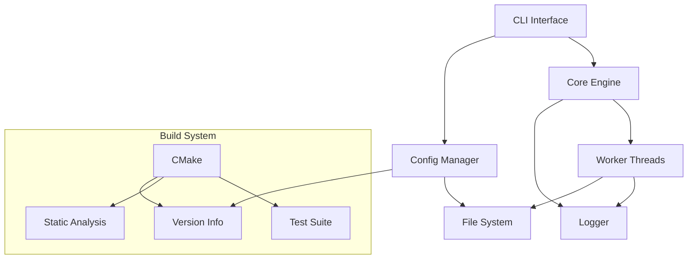

# Timbre Architecture

## Overview
Timbre is a modern C++ application designed for high performance and reliability. It uses a modular architecture with clear separation of concerns.

## Component Architecture



## Key Components

### Build System
- CMake-based build system
- Multi-architecture support (x86_64, arm64)
- Integrated static analysis
- Automated testing with Catch2
- Version management system

### Core Components
- **CLI Interface**: Command-line interface using CLI11
- **Config Manager**: TOML-based configuration system
- **Core Engine**: Main application logic
- **Logger**: Asynchronous logging system
- **Version System**: Semantic versioning with dev/release management

## Build Configurations


## Development Workflow


## File Organization
```
timbre/
├── inc/               # Public headers
│   ├── timbre/       # Core headers
│   ├── toml/         # TOML parser
│   └── CLI/          # CLI11 library
├── src/              # Implementation files
├── tests/            # Test suite
├── cmake/            # Build system
├── docs/             # Documentation
└── pkg/              # Packaging
``` 