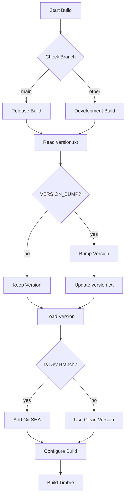

# Timbre Versioning System

## Overview
Timbre uses semantic versioning (MAJOR.MINOR.PATCH) with additional development version indicators. The version system distinguishes between release builds (on main branch) and development builds (on other branches).

## Version Format
- Release version: `X.Y.Z` (e.g., `1.2.3`)
- Development version: `X.Y.Z-dev_<sha>` (e.g., `1.2.3-dev_abcd1234`)

## Version Components
- `MAJOR` (X): Incremented for incompatible API changes
- `MINOR` (Y): Incremented for backward-compatible functionality additions
- `PATCH` (Z): Incremented for backward-compatible bug fixes
- `SHA`: 8-character git commit hash (only present in development builds)

## Version Flow

## Version File
The version is stored in `pkg/version.txt` in clean semantic version format (X.Y.Z). This file is:
- Read during build
- Updated during version bumps
- Used as source of truth for release versions

## Build System Integration
The versioning system is integrated into CMake and provides the following variables:
- `TIMBRE_VERSION_MAJOR`: Major version number
- `TIMBRE_VERSION_MINOR`: Minor version number
- `TIMBRE_VERSION_PATCH`: Patch version number
- `TIMBRE_VERSION_SHA`: Git commit SHA (8 chars)
- `TIMBRE_IS_DEV`: Build type indicator (1 for dev, 0 for release)

## Version Bumping
Version bumping is controlled through CMake options:
- `VERSION_BUMP`: Master switch for version bumping
- `BUMP_MAJOR`: Increment major version
- `BUMP_MINOR`: Increment minor version
- `BUMP_PATCH`: Increment patch version

## Pull Request Integration
Version bumps are typically triggered through pull requests using a template that specifies the type of version bump required:
- [ ] MAJOR: Breaking changes
- [ ] MINOR: New features
- [ ] PATCH: Bug fixes
- [ ] NONE: No version change 