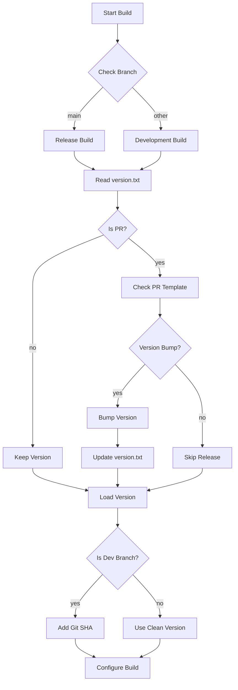

# Timbre Versioning System

## Overview
Timbre uses semantic versioning (MAJOR.MINOR.PATCH) with additional development version indicators. The version system distinguishes between release builds (on main branch) and development builds (on other branches).

## Version Format
- Release version: `X.Y.Z` (e.g., `1.2.3`)
- Development version: `X.Y.Z+<sha>` (e.g., `1.2.3+abcd1234`)

## Version Components
- `MAJOR` (X): Incremented for incompatible API changes
- `MINOR` (Y): Incremented for backward-compatible functionality additions
- `PATCH` (Z): Incremented for backward-compatible bug fixes
- `SHA`: 8-character git commit hash (only present in development builds)

## Version Flow

## Version File
The version is stored in `pkg/version.txt` in clean semantic version format (X.Y.Z). This file is:
- Read during build by Zig
- Updated during version bumps via GitHub Actions
- Used as source of truth for release versions

## Build System Integration
The versioning system is integrated into Zig and provides the following macros in `version.h`:
- `TIMBRE_VERSION_MAJOR`: Major version number
- `TIMBRE_VERSION_MINOR`: Minor version number
- `TIMBRE_VERSION_PATCH`: Patch version number
- `TIMBRE_VERSION_SHA`: Git commit SHA (8 chars)
- `TIMBRE_IS_DEV`: Build type indicator (1 for dev, 0 for release)

## Version Bumping
Version bumping is controlled through pull request templates:
- [ ] MAJOR: Breaking changes
- [ ] MINOR: New features
- [ ] PATCH: Bug fixes
- [ ] NONE: No version change

The GitHub Actions workflow validates the PR template and performs the appropriate version bump based on the selection. 